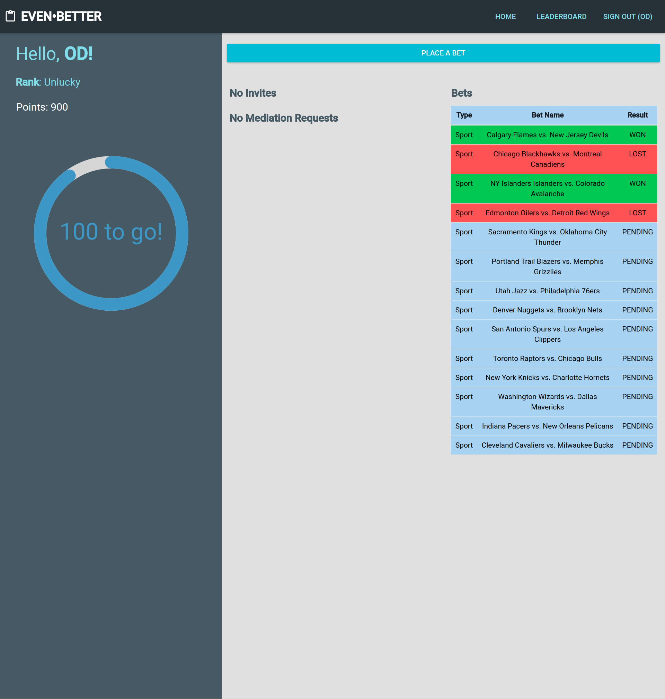
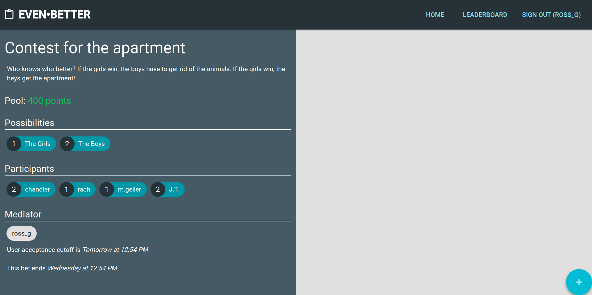
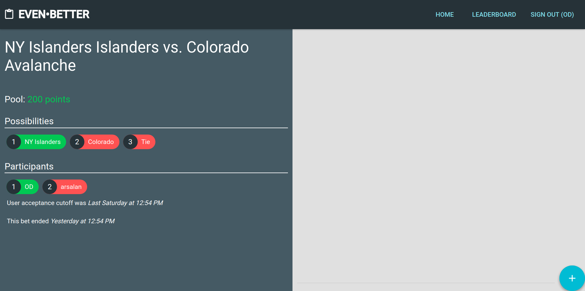

# EVEN•BETTER

Ever bet with a friend on something? Ever wish there was a way to keep track of how often you were right? With EvenBetter, now there is! Challenge your friends to a bet about ANYTHING and use Even Better's chat functionality to talk about it. Also use the exclusive Sports Bet functionality to pick a game from any major sport to bet on. We keep track of your points to ensure you've got bragging rights!

## Tech Stack
- ReactJS with Material UI
- Rails as an API
- PostgreSQL

## Setup Instructions
1. Clone the repo
2. Navigate to the rails server folder `cd even-better-server`
3. Start the server `rails s`
4. Navigate to the react front-end folder `cd even-better-app`
5. Start react `npm start` or `yarn start`
6. Open your browser and navigate to `http://localhost:3000/`

## Features
### Personal Bet
- Bet on absolutely anything
- Invite 1 or more friends to compete with
- Set 2 to any number of potential outcomes to bet on
- Invite a 3rd party mediator to select the outcome
- The prize pool is divided among the participants who selected the winning outcome

### Sports Bet
- Bet on any major sports game
- Invite 1 or more friends to compete with
- No need for a 3rd party mediator
- The winning outcome is determined by the outcome of the game received from our API
- The prize pool is divided among the participants who selected the winning outcome

## Screenshots

